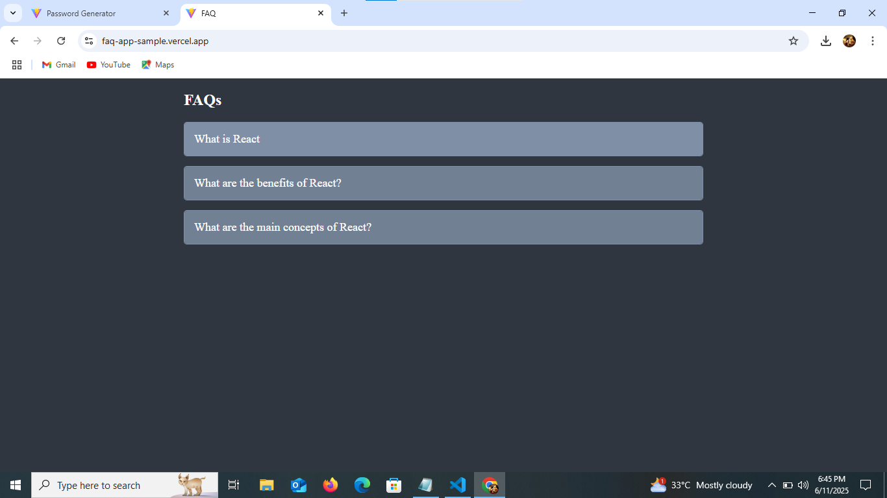
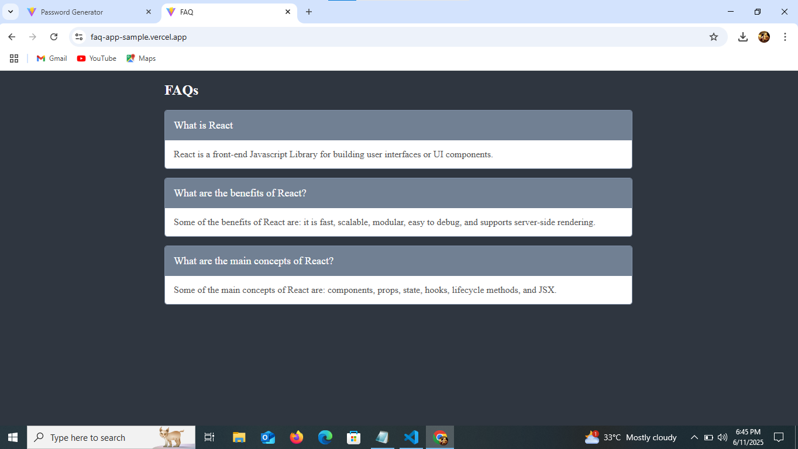

# React FAQ Accordion

A simple and interactive FAQ accordion built using React that expands answers when a question is clicked.

## Live Demo

🔗 [Live Demo](https://faq-app-sample.vercel.app/)  

## Developed By
**Gayathri G**  
GitHub: [GAYATHRI1006](https://github.com/GAYATHRI1006)

## Screenshot


  

  


## Features

- Click to toggle FAQ answers  
- Responsive layout  
- Reusable components (`FaqItem`, `FaqAccordion`)  
- Clean and modular structure using props and state  

## Getting Started

### 1. Clone the Repository

```bash
git clone https://github.com/GAYATHRI1006/Digital_Clock_using_React.git
```

### 2. Install Dependencies

```bash
npm install

```
### 3. Run the App

```bash
npm run dev
```

## Tech Stack

- **React**
- **JavaScript**
- **HTML5**
- **CSS3**          
